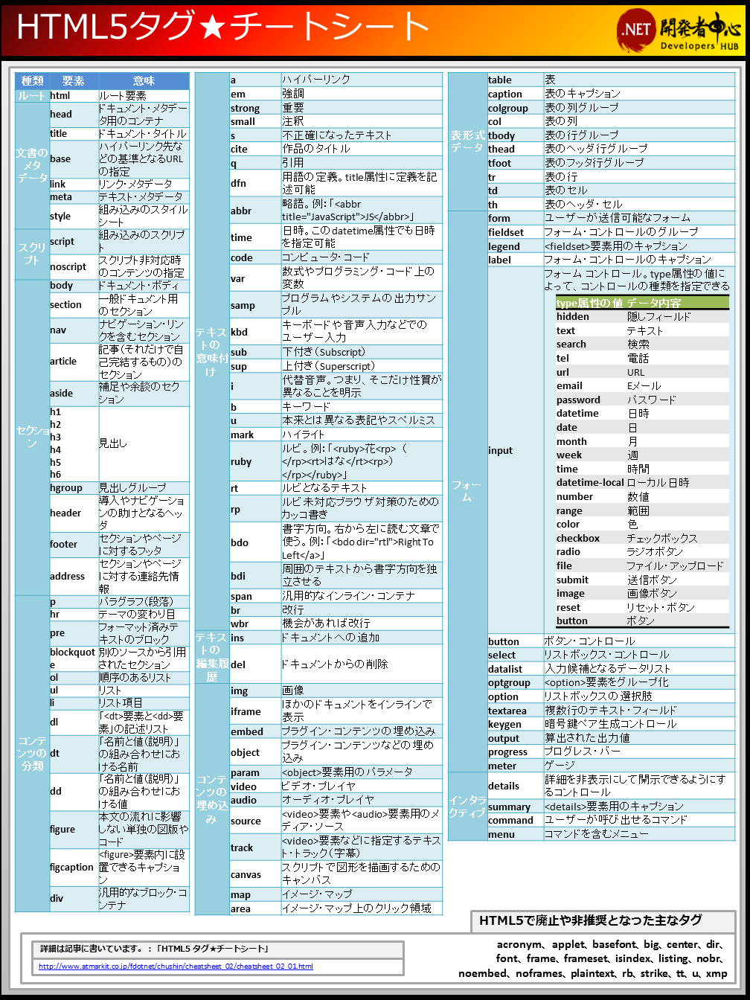

#タグ
##はじめに
ひとつ前の資料でタグを少しだけ理解しました。<br>
タグとはHTMLという文章に意味をもたせるものです。<br>
<br>
また、HTMLのタグはHTMLのバージョンが変わるごとに議論され、減ったり増えたりしています。<br>

##タグの種類
HTMLのタグは何種類あるでしょうか？<br>
実はたくさんあるわけではなく、108種類です。<br>
HTMLで使用されているタグの一覧の画像があったので見てみて下さい。<br>
<br>
<br>
<br>
皆さんが知っているタグもあれば初めて見るタグもあるのではないでしょうか？<br>
普段みなさんが見ているwebサイトも全てこの108個のタグで作成されています。<br>
これがHTMLのタグ全てです。

##色々なタグ
さて、全てのタグを表示してみましたが、全部を覚える必要はありません。<br>
使用頻度が高いものをいくつか説明していきたいと思います。
###見出し(h1~h6要素)
Heading(ヘディング)の略でサイトのタイトルを表すのに使われます。

`<h1>`が一番大きな見出し
`<h6>`が一番小さな見出し

```html
<h1>h1</h1>
<h2>h2</h2>
<h3>h3</h3>
<h4>h4</h4>
<h5>h5</h5>
<h6>h6</h6>
```

####出力結果


###段落（p要素）

Paragraph（パラグラフ）の略で、`<p>～</p>`で囲まれた部分がひとつの段落であることを表します。

```html
<p>段落を示します</p>
```

#### 出力結果
段落を示します

### 範囲（div要素）
divはDivisionの略で、特別な意味を持たない範囲のひとかたまりとして使われます。<br>
要するに、どのタグにも当てはまらないけど、タグで囲みたい時に使います。<br>
このように書くとあまり使われていないような気がしますが、使われることが非常に多いタグです。<br>

```html
<div>divisionを表します</div>
```

####出力結果
divisionを表します

###改行を行うためのタグ（br）
`<br>`はBreak（改行）の略です。<br>
※終了タグなしで使います。

```html
改行を行う<br>ためのタグ
```

####出力結果
改行を行う<br>ためのタグ

###区切りを表すためのタグ(hr)
Horizontal Rule(ホリゾンタル ルール)の略で水平の罫線を表します。

※区切り線はwidth属性を使用して横の長さを変えたりすることができます。

```html
<hr>
```

####出力結果
<hr>
<br>

###リスト（ul,ol,li要素）

- `<ol>` `<ul>` → リスト
- `<li>` → リストの項目

`<li>`(List Item)タグを使うときは、`<ol>`または`<ul>`タグで囲む

* `<ol>`（Ordered List） → 書いた順に数字が連番でつく
* `<ul>`（Unordered List） → 黒点が先頭につく

```html
<ol>
  <li>数字</li>
  <li>数字</li>
</ol>

<ul>
  <li>黒点</li>
  <li>黒点</li>
</ul>
```

####出力結果
<ol>
  <li>数字</li>
  <li>数字</li>
</ol>
<ul>
  <li>黒点</li>
  <li>黒点</li>
</ul>

<br>

### リンク(a要素)
リンクを生成するためのタグです。

```html
 <a href="リンク先のURL">リンク</a>
```

<br>

```html
<a href="http://nowall.co.jp/">NOWALL</a>
```

####出力結果

[NOWALL](http://nowall.co.jp/)

<br>
`<a>`タグに囲われているテキストが表示され、クリックすると指定したURLのページに移動します。
<br>
###画像の表示(img要素)
画像を表示したい場合は``タグで表示。表示させたい画像のパス（≒URL）を`src`属性の値として指定します。

```html

```
- `[alt="text"]` → 画像を表示しないブラウザの場合、画像の代わりにこの( text )が表示されます<br>
※ ``はテキストを囲む必要がないため、終了タグが要りません

<br>

```html

```


<br>

###テキストの斜体/重要(em/strong)
- `<em>`（Emphasis） → Internet ExplorerやNetscape Navigatorなどのブラウザでは斜体文字で表現されます。
- `<strong>` → `<em>`タグよりも強く **強調**を行いたい場合は`<strong>`タグを使用します（HTML5から「重要」の意味に変更）。

```html
<em>斜体文字</em>
```

####出力結果
<em>斜体文字</em>
<br>

```html
  <strong>強調したように表示されます</strong>
```

####出力結果
<strong>強調したように表示されます</strong>
<br>

###HTMLその他
- 上記以外にも様々な要素(タグ)があります。


<br>

### タグに付く属性に関して
いろんなタグを勉強したので、タグに付与することが出来る*属性*と呼ばれるものを勉強しましょう。<br>
属性とは*要素に情報を付加するもの*です。<br>
<br>
例えばリンクを使用する場合は以下のように`aタグ`の中に`href="http://nowall.co.jp/"`と書いてあります。<br>
この`href`を属性と呼びます。<br>
```html
<a href="http://nowall.co.jp/">NOWALL</a>
```
<br>
つまりaタグにhref属性が付いているというわけです。<br>
<br>
属性には様々な種類があり、どのタグにどの属性をつけることが出来るなどの決まりがあります。<br>
例えば`aタグ`にhref属性をつけるとリンク先として機能しますが、`divタグ`にhref属性を付けても機能しませんし何も起こりません。<br>
```html
<!-- aタグにhrefをつけるとリンク先として機能する -->
<a href="http://nowall.co.jp/">NOWALL</a>

<!-- divタグにhrefをつけても何もおこらない -->
<div href="http://nowall.co.jp/">NOWALL</div>
```
<br>
また、一番使用頻度が高い属性として`id属性`と`class属性`があります。<br>
<br>
`id属性`と`class属性`は主にCSSやJavascriptとhtmlを関連させるための**目印**に使用します。<br>
```html
<!-- headerタグのid属性にtop-headerという値を設定 -->
<header id="top-header"></header>

<!-- divタグのclass属性にbtnという値を設定 -->
<div class="btn"></div>
```
<br>
`id="top-header"の部分をクリックしたら○○してね`や、`class="btn"がついてる要素の背景色を赤色にする`などといったように使います。<br>
<!-- <a href="http://qiita.com/ayumihidaka/private/d60c314ef47b4888f6ef" target="_blank">div要素の id と class の違い</a><br> -->
<br>
また、idとclassには少しだけルールが決められており、以下の様な決まりを守らなければなりません。

* id → 1ページ内で同じ名前を1回しか使用できない、同じものを同一ページで使用した場合、２つ目以降は無視される
* class → 1ページ内で同じ名前を何度も使用できる

・classは半角スペースで区切ることで複数設定可能<br>
```html
  <div class="a"></div>
  <div class="a b"></div>
  <div class="a b c"></div>
```

idやclassを使用したタグの構成図は以下の様な感じです。<br>

<br>
HTMLを書くだけだとあまり使用することはないかもしれませんが、CSSやJavascriptを使おうとすると、idやclassは必ず使用するので覚えておいて下さい。<br>
<br>

## 番外編：コードを綺麗に書くために階層構造を意識しよう
コードには`開始タグ`と`終了タグ`がありますが、開始タグと終了タグは同じ階層に書いたほうが、どの開始タグがどの終了タグに対応しているかがわかっていいです。<br>
<br>
例えば以下のようなコードだと開始タグと終了タグの対応がひと目でわかりづらいですよね。

```html
<!DOCTYPE html>
    <html lang="ja">
    <head><!-- このタグの終了タグの場所は？ -->
        <meta charset="UTF-8">
    <title>タイトル</title>
  </head>
  <body>
  <div>ここがメインの場所です</div>
    <ul><!-- このタグの終了タグの場所は？ -->
          <li>メニュー</li><li>メニュー</li><li>メニュー</li><li>メニュー</li>
        </ul><footer>フッターです</footer>
  </body>
</html>
```
<br>
上記のコードも開始タグと終了タグの対応を意識して書くことができれば以下のようになり、対応がひと目で分かります。<br>
```html
<!DOCTYPE html>
<html lang="ja">
  <head><!-- headerの開始 -->
    <meta charset="UTF-8">
    <title>タイトル</title>
  </head><!-- headerの終了 -->
  <body>
    <div>ここがメインの場所です</div>
    <ul><!-- ulの開始 -->
      <li>メニュー</li>
      <li>メニュー</li>
      <li>メニュー</li>
      <li>メニュー</li>
    </ul><!-- ulの終了 -->
    <footer>フッターです</footer>
  </body>
</html>
```
<br>
なるべくタグの対応を意識しながらコードは書いていきましょう。<br>
<br>
##タグまとめ
タグの種類を沢山説明しましたが、適当なタグを付けるだけでレイアウトは完成します。<br>
極端な話、全て`divタグ`や`spanタグ`など１つのタグだけで作成してもレイアウトは作成することが出来ます。<br>
<br>
しかし、私たちはレイアウトを見ればサイトの構造を理解できますが、PCは理解できません。<br>
また、タグを意識しないで書くとコードを見た時に一目でコードが何を表しているかを理解することも出来ないのでできるだけ適切なタグを使用して書くように気をつけましょう。
