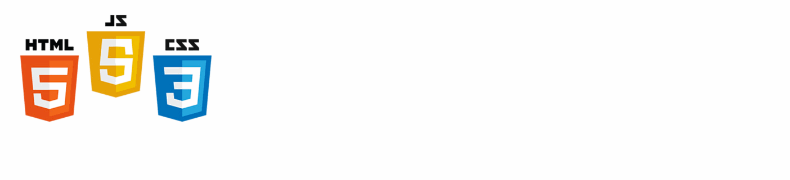
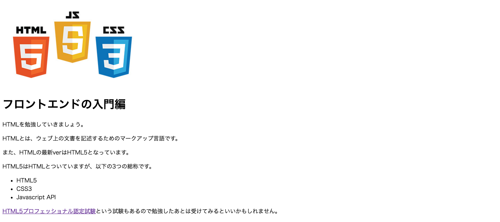

# タグの練習

## 1. 見出し・段落
下記の画像と同じ表示をするHTMLのコードを書いてみましょう。<br>
<br>


## 2. リスト
下記の画像と同じ表示をするHTMLのコードを書いてみましょう。<br>
<br>


## 3. リンク
下記図のように`<h2>`を使用し「タイトル」、「リンク１」、リストでの「リンク２」「リンク３」を作成してみましょう。<br>
<br>


## 4. 画像
画面に画像を表示してみましょう。<br>
※画像のurlは`http://html5fun.jp/common/img/img_about.jpg`を使用して下さい。<br>
<br>
<br>

## 5. 画像をリンク化
画像をクリックしたら指定したリンクに飛ぶように変更してみましょう。<br>
※画像のurlは`http://html5fun.jp/common/img/img_about.jpg`を使用して下さい。<br>
※リンク先は `http://html5j.org/`に指定して下さい。

<br>

## 6. 属性を設定しよう
以下のようなhtmlがあります。<br>
以下のように属性を付与してみてください。

- aタグにtitle属性を付与、値は`html5japan`
- imgタグにtarget属性を付与、値は`_blank`

```html
<a href="http://html5j.org/"></a>
```

## 7. 簡単なWebページの作成
少し難しいですが、サンプルのwebページを作成してみましょう！<br>
※画像のurlは`http://html5fun.jp/common/img/img_about.jpg`を使用して下さい。<br>
HTML5プロフェッショナル認定試験のリンクは`http://html5exam.jp/`を使用してください。<br>
タグの対応を意識しながら書いてみましょう！
<br>

# 以下、回答例

## 1. 初めてのhtml
```html
<!-- 回答例 -->
<h1>見出し(h1)</h1>
<p>段落(p)段落(p)</p>
<hr>
<h3>見出し(h3)</h3>
<p>段落(p)段落(p)<br>段落(p)段落(p)</p>
<hr>
<h6>見出し(h6)</h6>
<p>段落(p)段落(p)<br>段落(p)段落(p)<br>段落(p)段落(p)</p>
```

## 2. リスト
```html
<!-- 解答例 -->
<h4>４番目に大きな見出し</h4>
<ul>
  <li>リスト１</li>
  <li>リスト２</li>
</ul>
<h4>４番目に番大きな見出し</h4>
<ol>
  <li>リスト１</li>
  <li>リスト２</li>
  <li>リスト３</li>
</ol>
```

## 3. リンク
```html
<h2>タイトル</h2>
<a href="">リンク１</a>
<ul>
  <li><a href="">リンク２</a></li>
  <li><a href="">リンク３</a></li>
</ul>
```

## 4. 画像
```html
<!-- 解答例 -->

```

## 5. 画像をリンク化
```html
<!-- 解答例 -->
<a href="http://html5j.org/"></a>
```

## 6. 属性を設定しよう

```html
<a href="http://html5j.org/" title="html5japan">
  
</a>
```

## 7. 簡単なWebページの作成

```html
<!DOCTYPE html>
<html lang="ja">
  <head>
    <meta charset="UTF-8">
    <title>タイトル</title>
  </head>
  <body>
    
    <h1>ELITES CAMP「HTML/CSS編」</h1>
    <p>開催日：2016年5月1日</p>
    <p>HTMLとは、ウェブ上の文書を記述するためのマークアップ言語で、<br>
    CSSとはウェブページのスタイルを指定するための言語です。<br>
    当講座では、HTML/CSSの基礎、WEB制作の基礎を一通り習得し、
    実際にホームページを作成していきます。</p>
    <a href="http://spartacamp.jp/">ELITES CAMP公式ホームページ</a>
  </body>
</html>
```
